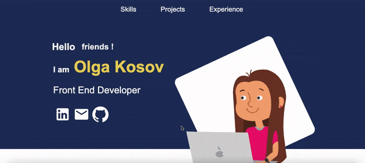

# react_portfolio

### About project:

It is portfolio site with examples of my works in programming, illustration and design, hobby which was done on React.

### Tehnology: 

* HTML
* CSS
* JavaScript
* React
* GitHub

# Installation
To run on a local machine, you need:

1. Install npm dependencies:
### `npm install`
2. Run in development mode:
### `npm run start`

If everything went right, the project will be launched on [http://localhost:3000](http://localhost:3000)

# Additional programs which I used:

Creating a form to send emails [https://app.getform.io/forms](https://app.getform.io/forms)

Download fonts for project [https://fonts.google.com/](https://fonts.google.com/)

React Icons [https://react-icons.github.io/](https://react-icons.github.io/)

Simplify css markup in code [https://tailwindcss.com](https://tailwindcss.com)

# Preview

